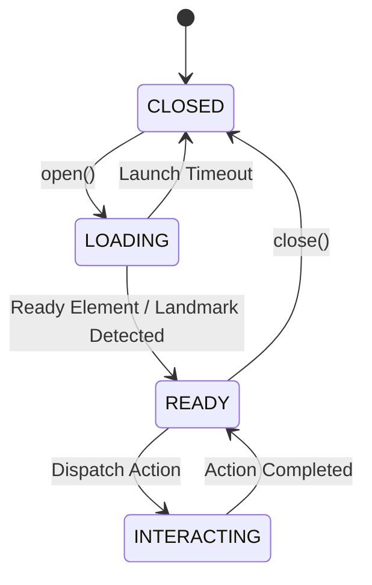

---
type: Architecture Specification
title: "Pymordial Core — Controller, App Lifecycle & State Machine"
description: "Core architectural abstractions of the Pymordial framework: PymordialController coordinator, PymordialApp state machine, and component registry."
resource: package:pymordial.core
tags: [pymordial, core, architecture, controller, app-lifecycle, state-machine, registry]
status: stable
generated:
  by: human:IAmNo1Special
  at: 2026-09-16T12:00:00Z
verified:
  - by: human:IAmNo1Special
    at: 2026-09-16T12:00:00Z
sources:
  - id: pymordial-source
    resource: package:pymordial.core
    title: "Pymordial Core Module"
---

# Pymordial Core — Controller, App Lifecycle & State Machine

The Pymordial Core package establishes the foundational abstractions, driver contracts, and state-aware lifecycle management for game and application automation.

---

## 1. The Controller (`PymordialController`)

The `PymordialController` acts as the central coordinator in the automation pipeline:
- **Device Management**: Houses active device drivers adhering to core blueprints (`BridgeDevice`, `VisionDevice`, `OCRDevice`, `EmulatorDevice`).
- **Application Registry**: Manages registered `PymordialApp` instances.
- **Input Dispatching**: Exposes standardized input primitives (taps, swipes, precise drags, key presses) routed to the underlying bridge.
- **Perception Orchestration**: Coordinates template matching and OCR against the current visual frame.

---

## 2. App Lifecycle & State Awareness (`PymordialApp`)

Uncontrolled scripts frequently fail by sending inputs before an application is ready. `PymordialApp` wraps target applications in a deterministic `StateMachine`:

### Lifecycle States
1. **`CLOSED`**: The target application process is not active or verified.
2. **`LOADING`**: The application has been launched; the system actively monitors the display for designated "Ready Elements" (e.g. title screen, main menu).
3. **`READY`**: Landmark detection confirms the UI is interactive. Automation routines may safely execute actions.

---

## 3. Screen & Action Management (`PymordialScreen`)

- **Screen Abstraction**: Each screen models a distinct graphical state (e.g. Overworld, Inventory, Dialogue).
- **Identification Heuristic**: Implements `is_current_screen()` via presence checks of unique child elements (`UIElement`).
- **Action Registry**: Registers callable actions with defined transition expectations and recovery handlers.

See also: [UI Elements](./ui_elements.md) and [Device Blueprints](./device_blueprints.md).