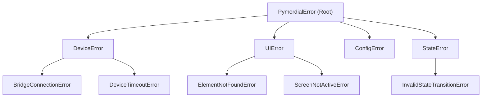

---
type: Configuration Guide
title: "Pymordial Core — Configuration Management & Exceptions"
description: "Configuration loading schema, YAML validation, environment resolution, and Pymordial exception hierarchy."
resource: package:pymordial.utils
tags: [pymordial, config, yaml, validation, exceptions, error-handling]
status: stable
generated:
  by: human:IAmNo1Special
  at: 2026-09-16T12:00:00Z
verified:
  - by: human:IAmNo1Special
    at: 2026-09-16T12:00:00Z
sources:
  - id: pymordial-utils-source
    resource: package:pymordial.utils
    title: "Pymordial Utils Module"
---

# Pymordial Core — Configuration Management & Exceptions

Pymordial centralizes runtime parameters through typed configurations and a comprehensive domain exception hierarchy.

---

## 1. Configuration System (`configs.yaml`)

Configuration resolution supports layered merging:
1. **Default Manifest**: Shipped within `pymordial/configs.yaml`.
2. **User Overrides**: Optional project-level config YAML files specified at controller initialization.
3. **Environment Variables**: Overrides prefixed with `PYMORDIAL_` (e.g. `PYMORDIAL_ADB_PATH`, `PYMORDIAL_TIMEOUT`).

### Key Parameters
- `device.connection_timeout`: Maximum duration in seconds to wait for driver bridge initialization.
- `vision.default_threshold`: Default matching threshold for `PymordialImage` ($0.80$).
- `polling.interval`: Polling interval for element wait loops ($0.1\text{ s}$).

---

## 2. Exception Hierarchy (`pymordial.utils.exceptions`)

Structured errors allow automated recovery without script aborts:

See also: [Architecture](./architecture.md) and [Device Blueprints](./device_blueprints.md).